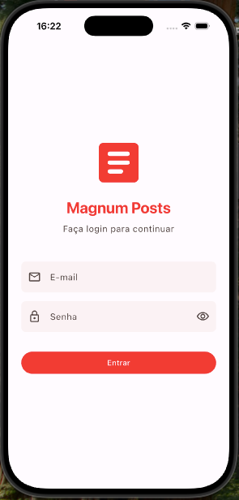
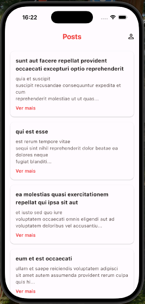
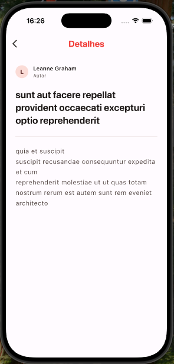
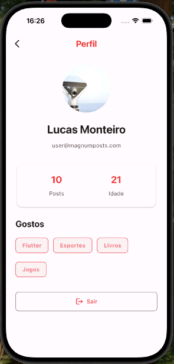
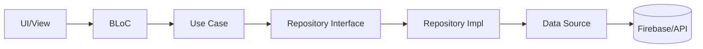

# 📱 Magnum Posts

Aplicativo Flutter para visualização e interação com posts, desenvolvido seguindo os princípios de **Clean Architecture** e boas práticas de desenvolvimento mobile.

<p align="center">
  
  
  
  
</p>

---

## 🔐 Credenciais de Acesso

| Campo    | Valor                  |
|----------|------------------------|
| **Email**    | `user@magnumposts.com` |
| **Senha**    | `123456`               |

---

## 🚀 Rodando o Projeto

### Pré-requisitos

- Flutter SDK `^3.38.7`
- Dart SDK `^3.10.7`
- Android Studio / Xcode (para emuladores)
- Dispositivo físico ou emulador configurado

### Executar o App

Se houver apenas um dispositivo conectado:

```bash
flutter run
```

Se houver mais de um dispositivo conectado:

```bash
flutter devices  # Lista os dispositivos disponíveis
flutter run -d <deviceID>
```

---

## 🧪 Rodando os Testes

### Testes Unitários

Sem coverage:

```bash
flutter test test/
```

Com coverage:

```bash
flutter test --machine --coverage > tests.output
```

### Testes de Integração

Primeiro, identifique o dispositivo conectado:

```bash
adb devices
```

Copie o `<DEVICE_ID>` e execute os testes de cada view:

```bash
# SignIn View
flutter test integration_test/presentation/sign_in_view/sign_in_view_test.dart -d <DEVICE_ID>

# Posts View
flutter test integration_test/presentation/posts_view/posts_view_test.dart -d <DEVICE_ID>

# Post Details View
flutter test integration_test/presentation/posts_details_view/posts_details_view_test.dart -d <DEVICE_ID>

# Profile View
flutter test integration_test/presentation/profile_view/profile_view_test.dart -d <DEVICE_ID>
```

---

## 🏗️ Arquitetura

O projeto segue os princípios da **Clean Architecture**, organizando o código em camadas bem definidas que garantem:

- **Separação de responsabilidades**
- **Testabilidade**
- **Manutenibilidade**
- **Escalabilidade**

### Estrutura de Pastas

```
lib/
├── main.dart
└── modules/
    ├── app/
    │   ├── app_module.dart
    │   └── presentation/
    │       └── app_widget.dart
    │
    ├── module_name/
    │   ├── module_name_module.dart
    │   ├── core/
    │   │   ├── data/
    │   │   │   ├── datasources/
    │   │   │   │   ├── datasource.dart
    │   │   │   │   └── datasource_impl.dart
    │   │   │   ├── models/
    │   │   │   │   └── model.dart
    │   │   │   └── repositories/
    │   │   │       └── repository_impl.dart
    │   │   │
    │   │   └── domain/
    │   │       ├── entities/
    │   │       │   └── entity.dart
    │   │       ├── repositories/
    │   │       │   └── repository.dart
    │   │       └── use_cases/
    │   │           ├── use_case.dart
    │   │           └── use_case_impl.dart
    │   │
    │   └── presentation/
    │       ├── bloc/
    │       │   ├── bloc.dart
    │       │   └── bloc_custom_state.dart
    │       ├──components/
    │       └── views/
    │           └── view.dart
    │
    └── commons/
        ├── commons_module.dart
        ├── core/
        ├── presentation/
        └── utils/
```

### Camadas da Arquitetura

| Camada | Responsabilidade |
|--------|------------------|
| **Presentation** | UI (Widgets), BLoC (gerenciamento de estado), navegação |
| **Domain** | Entidades, Repositórios (contratos), Use Cases (regras de negócio) |
| **Data** | Implementações de repositórios, Data Sources, Models |

### Fluxo de Dados



---

## 📦 Principais Dependências

| Pacote | Finalidade |
|--------|------------|
| `flutter_modular` | Injeção de dependências e navegação modular |
| `flutter_bloc` | Gerenciamento de estado reativo |
| `dio` | Cliente HTTP para requisições à API |
| `firebase_auth` | Autenticação de usuários |
| `cloud_firestore` | Banco de dados em tempo real |
| `equatable` | Comparação de objetos (imutabilidade) |
| `flutter_animate` | Animações declarativas |
| `shared_preferences` | Persistência local |

### Dependências de Desenvolvimento/Testes

| Pacote | Finalidade |
|--------|------------|
| `mocktail` | Mocking para testes unitários |
| `bloc_test` | Testes de BLoC |
| `firebase_auth_mocks` | Mock do Firebase Auth |
| `fake_cloud_firestore` | Mock do Cloud Firestore |
| `modular_test` | Testes de módulos |

---

## 🔮 Escalabilidade e Expansão

### Adicionando Novos Módulos

1. Crie uma nova pasta em `lib/modules/novo_modulo/`
2. Siga a estrutura padrão: `core/data`, `core/domain`, `presentation`
3. Registre o módulo no `AppModule`

### Design Patterns Utilizados

- **Repository Pattern**: Abstração da fonte de dados
- **BLoC Pattern**: Gerenciamento de estado previsível
- **Dependency Injection**: Via Flutter Modular
- **Factory Pattern**: Criação de instâncias de models a partir de JSON

---

## 📁 Módulos do Projeto

| Módulo | Descrição |
|--------|-----------|
| `app` | Configuração principal do aplicativo e tema |
| `auth` | Autenticação e login de usuários |
| `posts` | Listagem, detalhes e interações com posts |
| `profile` | Visualização do perfil do usuário |
| `commons` | Componentes, utilitários e recursos compartilhados |

---

## 📄 Licença

Este projeto foi desenvolvido como parte de um desafio técnico.
